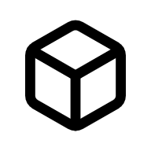

 
 <h1 align="center">
  SolidUI
 </h1>

This is an unofficial port of [shadcn/ui](https://github.com/shadcn-ui/ui) & [tremor-raw](https://github.com/tremorlabs/tremor-raw) to [Solid](https://www.solidjs.com/).

Accessible and customizable components that you can copy and paste into your apps. Free. Open Source. **Use this to build your own component library**.

## Documentation

Visit https://www.solid-ui.com to view the documentation.

## License

Published under the [MIT license](LICENSE). Built by [@stefan-karger](https://github.com/stefan-karger), [@michaelessiet](https://github.com/michaelessiet) & [community](https://github.com/stefan-karger/solid-ui/graphs/contributors).

## Star History

