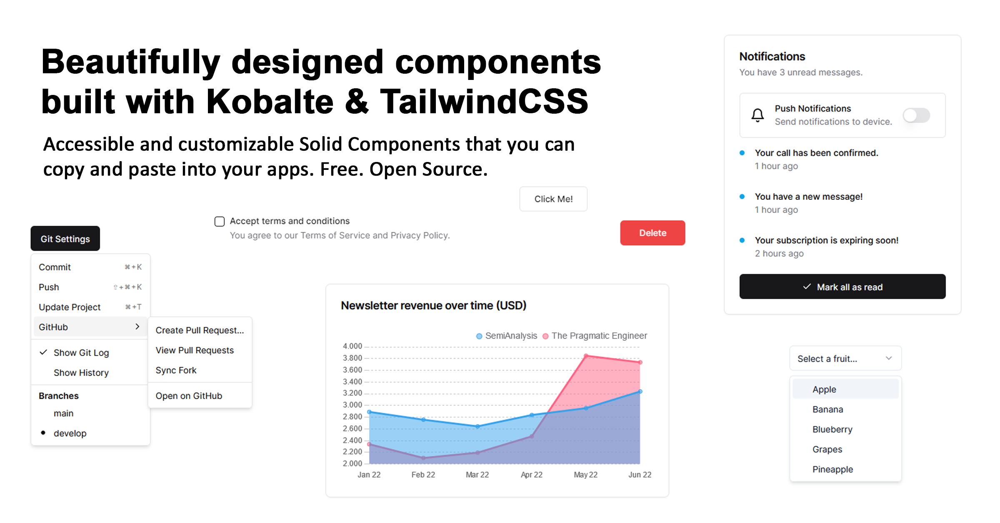

 
 <h1 align="center">
  SolidUI
 </h1>

This is an unofficial community-led [Solid](https://www.solidjs.com/) port of [shadcn/ui](https://ui.shadcn.com/) & [tremor](https://www.tremor.so/).

Accessible and customizable components that you can copy and paste into your apps. Free. Open Source. **Use this to build your own component library**.

## Documentation

Visit https://www.solid-ui.com to view the documentation.

## License

Published under the [MIT license](https://github.com/shadcn/ui/blob/main/LICENSE.md). Built by [@sek-consulting](https://github.com/sek-consulting), [@michaelessiet](https://github.com/michaelessiet) & [community](https://github.com/sek-consulting/solid-ui/graphs/contributors).

## Star History

