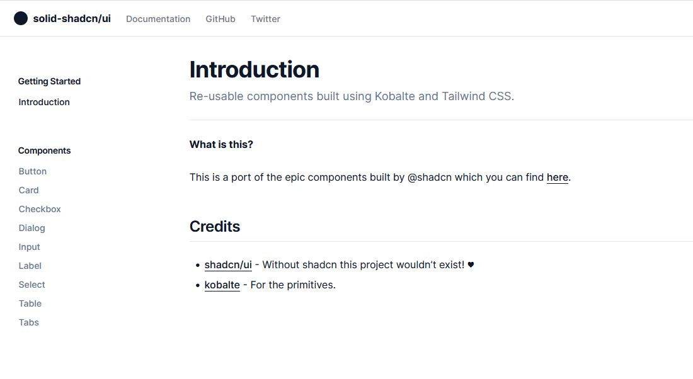

# solid-shadcn/ui

**What is this?**

This is a port of the epic components built by @shadcn which you can find [here](https://ui.shadcn.com).

## Finished components

- Button
- Card
- Checkbox
- Dialog
- Input
- Label
- Select
- Switch
- Table
- Tabs
- Textarea

## Currently working on

- Data Table
- Dropdown
- Toast

## Unsure if portable

- Command / cmdk
- Calendar

## Credits

- [shadcn/ui](https://github.com/shadcn/ui) - Without shadcn this project wouldn't exist! ♥
- [kobalte](https://github.com/kobaltedev/kobalte) - For the primitives.

## Want to contribute?

Feel free to create issues and pull requests or start a discussion.
