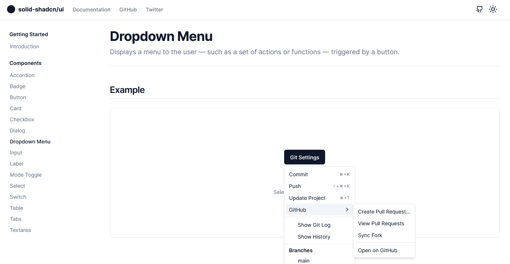

# Solid/UI

This project aims to port the following projects to SolidJS:

- [shadcn/ui](https://ui.shadcn.com)
- [tremor](https://www.tremor.so/)

## Project Status

### shadcn/ui

| Component     | finished | in progress | pending |
| ------------- | -------- | ----------- | ------- |
| Accordion     | ✔️       |             |         |
| Avatar        | ✔️       |             |         |
| Badge         | ✔️       |             |         |
| Button        | ✔️       |             |         |
| Calendar      |          |             | ❓      |
| Card          | ✔️       |             |         |
| Checkbox      | ✔️       |             |         |
| Command       |          |             | ❓      |
| Data Table    |          | 💻          |         |
| Dialog        | ✔️       |             |         |
| Dropdown Menu | ✔️       |             |         |
| Input         | ✔️       |             |         |
| Label         | ✔️       |             |         |
| Mode Toggle   | ✔️       |             |         |
| Popover       | ✔️       |             |         |
| Progress      | ✔️       |             |         |
| Radio Group   | ✔️       |             |         |
| Select        | ✔️       |             |         |
| Separator     | ✔️       |             |         |
| Sheet         | ✔️       |             |         |
| Switch        | ✔️       |             |         |
| Table         | ✔️       |             |         |
| Tabs          | ✔️       |             |         |
| Textarea      | ✔️       |             |         |
| Toast         |          | 💻          |         |

### tremor

| Component  | finished | in progress | pending |
| ---------- | -------- | ----------- | ------- |
| BadgeDelta | ✔️       |             |         |
| Callout    | ✔️       |             |         |
| Flex       | ✔️       |             |         |
| Grid       | ✔️       |             |         |

## Credits

- [@shadcn](https://twitter.com/shadcn) - Without @shadcn I wouldn't have started this project at all!
- [Kobalte.](https://github.com/kobaltedev/kobalte) - For the primitives.

## Want to contribute?

Feel free to create issues and pull requests or start a discussion.
